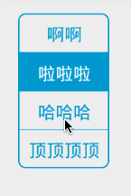
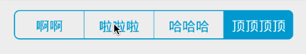
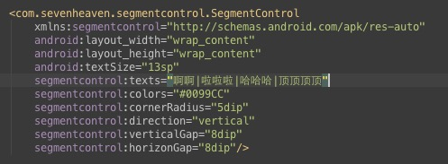
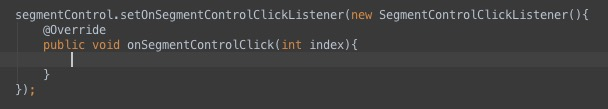

 

#a simple SegmentControl Widget

##Usage
***

set segmentControl's property using attrs,using '|' to separate segments.

using OnSegmentControlClickListener to listen to segment change event.

